<div align="center">


# TaskBoost — Task Manager

### A Professional Flutter Task Management Application

[](https://flutter.dev)
[](https://dart.dev)
[](https://supabase.com)
[](https://riverpod.dev)
[](https://emailjs.com)
[](LICENSE)
[](https://github.com/Ali-Hassan-edu)

> *A full-featured task management system with Admin & User roles, real-time notifications, automated email alerts, password reset via deep link, and a beautiful animated UI — built with Flutter & Supabase.*

[Features](#-features) • [Screenshots](#-screenshots) • [Email Notifications](#-email-notifications) • [Architecture](#-architecture) • [Setup](#-getting-started) • [Tech Stack](#-tech-stack)

---

</div>

## ✨ Features

### 👑 Admin Features
| Feature | Description |
|---|---|
| 🗂️ **Admin Dashboard** | Real-time stats — Total, Completed, Pending, Overdue with live progress bar |
| ➕ **Create Users** | Add team members; login credentials auto-emailed instantly via EmailJS |
| 📌 **Assign Tasks** | Create & assign tasks with priority (Low / Medium / High) and due dates |
| 👥 **Team Management** | View, search and manage all team members |
| 🔔 **Admin Alerts** | Real-time notifications when users complete assigned tasks |
| ⚙️ **Settings** | Profile photo upload (gallery/camera), edit display name, sign out |

### 👤 User Features
| Feature | Description |
|---|---|
| 🏠 **User Dashboard** | Personal live stats: Total, Pending, Active, Done |
| ✅ **Task Management** | Start and complete tasks — Pending / In Progress / Done tabs |
| 🔔 **Notifications** | Real-time alerts when new tasks are assigned |
| 📧 **Email Alerts** | Email notification received when a task is assigned |
| ⚙️ **Settings** | Profile photo, display name, app version |

### 🔐 Auth Features
- Email & Password login
- Google Sign-In (OAuth)
- Forgot Password with deep-link reset (PKCE flow via `app_links`)
- Persistent sessions with auto-login
- Role-based routing (Admin / User)

---

## 📱 Screenshots

### 🔐 Authentication

<div align="center">

| Splash Screen | Login Screen | Forgot Password |
|:---:|:---:|:---:|
| 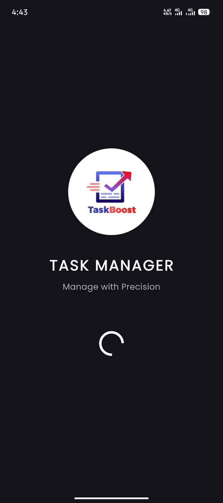 | 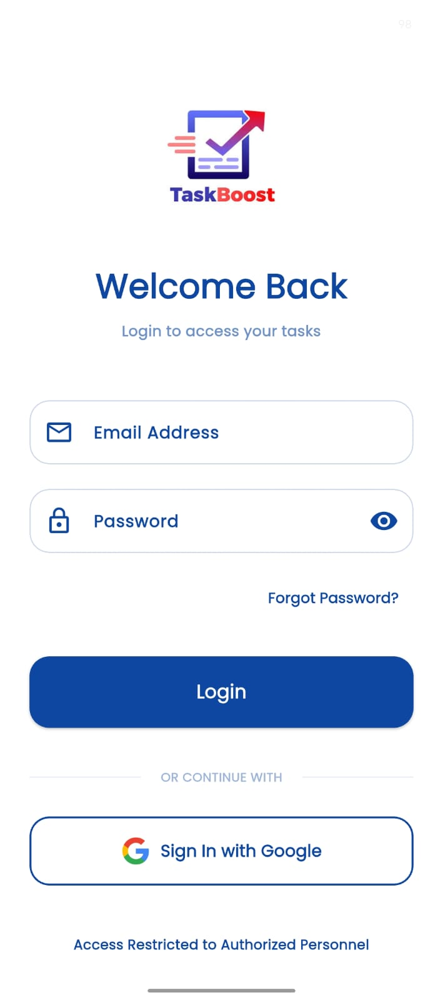 | 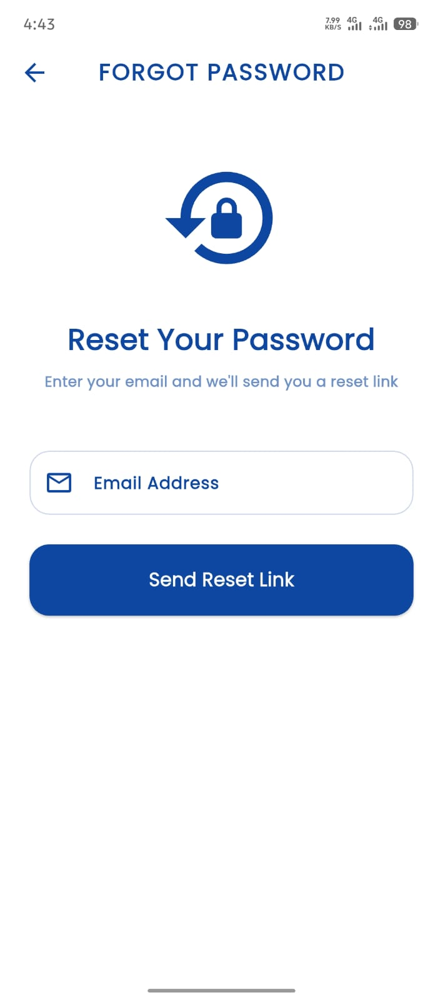 |

</div>

### 👑 Admin Panel

<div align="center">

| Dashboard | Assign Task | Team Members |
|:---:|:---:|:---:|
| 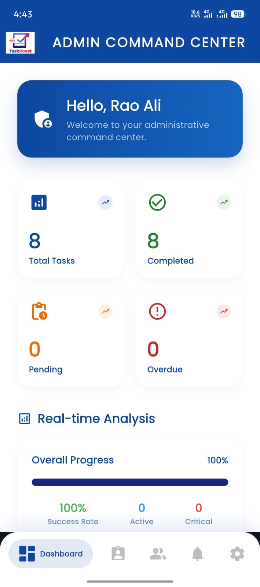 | 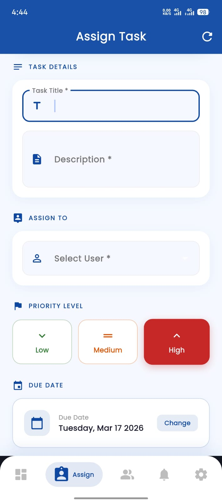 | 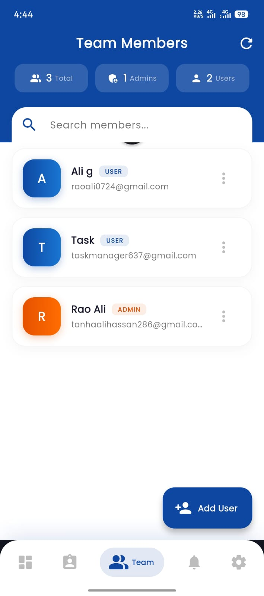 |

| Admin Alerts | Settings |
|:---:|:---:|
| 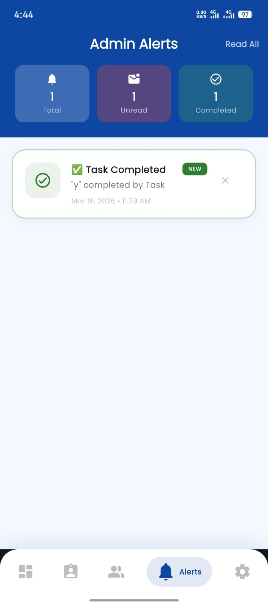 | 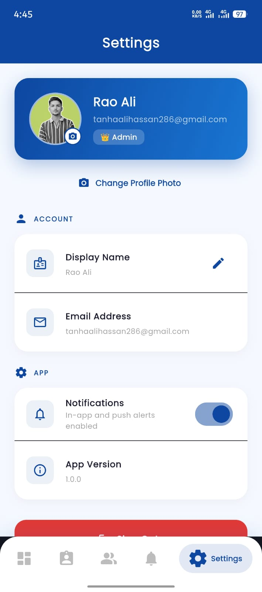 |

</div>

### 👤 User Panel

<div align="center">

| User Dashboard | My Tasks | Notifications |
|:---:|:---:|:---:|
| 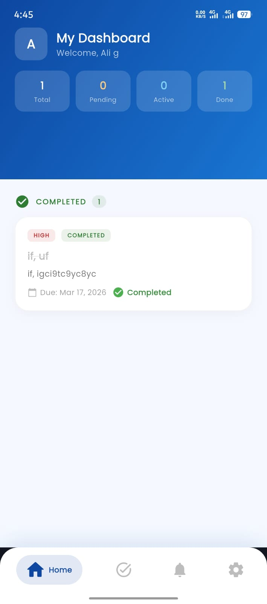 | 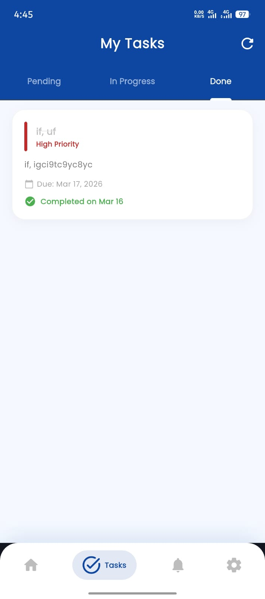 | 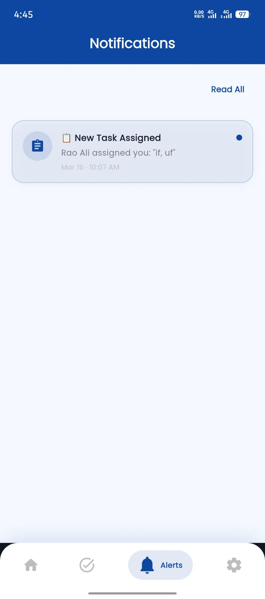 |

</div>

### 📧 Email Notifications (Automated via EmailJS)

<div align="center">

| Welcome Email (New User) | Task Assigned Email |
|:---:|:---:|
| 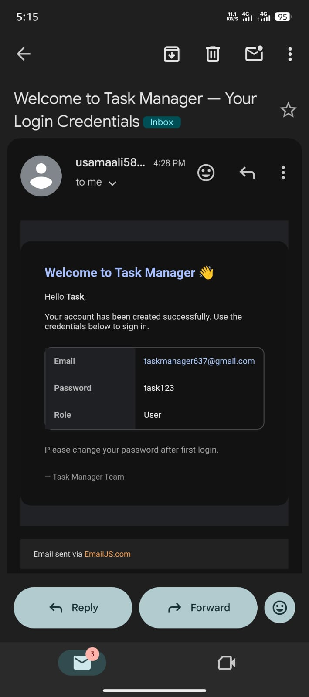 | 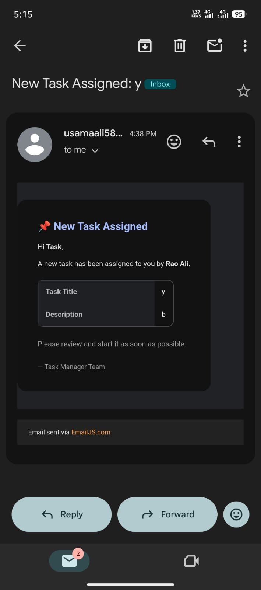 |

> When an admin creates a new user, the user instantly receives an email with their login credentials. When a task is assigned, the user receives a detailed task email — all automated via EmailJS.

</div>

---

## 🏗️ Architecture

Clean Architecture with clear separation of concerns:

```
lib/
├── core/
│   ├── services/        # Email, push notifications, profile image, session
│   ├── theme/           # App theme & colors
│   └── utils/           # Constants
│
├── data/
│   └── repositories/    # Supabase + local implementations
│
├── domain/
│   ├── entities/        # User, Task models
│   └── repositories/    # Abstract interfaces
│
└── presentation/
    ├── providers/        # Riverpod state management
    └── screens/
        ├── admin/        # Dashboard, Assign Task, Team, Alerts
        ├── auth/         # Login, Signup, Forgot/Reset Password, Splash
        ├── user/         # Dashboard, Tasks, Notifications
        ├── settings_screen.dart
        └── main_screen.dart
```

### State Management
- **Riverpod** — `Provider`, `StateNotifier`, `StreamProvider`, `FutureProvider`
- **Real-time** data via Supabase Realtime streams
- **Persistent** auth via `SharedPreferences` + `FlutterSecureStorage`

---

## 🗄️ Database Schema

```sql
-- Users
users (
  id                  UUID PRIMARY KEY,
  name                TEXT,
  email               TEXT UNIQUE,
  role                TEXT,        -- 'admin' | 'user'
  created_by_admin_id UUID
)

-- Tasks
tasks (
  id              UUID PRIMARY KEY,
  title           TEXT,
  description     TEXT,
  priority        TEXT,            -- 'Low' | 'Medium' | 'High'
  status          TEXT,            -- 'Pending' | 'In Progress' | 'Completed'
  dueDate         TIMESTAMP,
  assignedToId    UUID,
  assignedToName  TEXT,
  admin_id        UUID,
  createdAt       TIMESTAMP,
  completedAt     TIMESTAMP
)

-- Notifications
notifications (
  id          UUID PRIMARY KEY,
  user_id     UUID,
  title       TEXT,
  message     TEXT,
  type        TEXT,
  is_read     BOOLEAN DEFAULT false,
  created_at  TIMESTAMP DEFAULT now()
)
```

---

## 🚀 Getting Started

### Prerequisites
- Flutter SDK `^3.5.0`
- Dart SDK `^3.5.0`
- Android Studio / VS Code
- Supabase account
- EmailJS account

### Installation

**1. Clone the repository**
```bash
git clone https://github.com/Ali-Hassan-edu/App-development-repo.git
cd App-development-repo/task_manager
```

**2. Install dependencies**
```bash
flutter pub get
```

**3. Configure Supabase** — update `lib/main.dart`:
```dart
await Supabase.initialize(
  url: 'YOUR_SUPABASE_URL',
  anonKey: 'YOUR_SUPABASE_ANON_KEY',
);
```

**4. Configure EmailJS** — update `lib/core/services/email_service.dart`:
```dart
static const String serviceId = 'YOUR_SERVICE_ID';
static const String publicKey = 'YOUR_PUBLIC_KEY';
```

**5. Generate app icon**
```bash
dart run flutter_launcher_icons
```

**6. Run**
```bash
flutter run
```

---

## 📧 Email Notifications

Emails sent automatically via **EmailJS** for:

| Event | Recipient | Content |
|---|---|---|
| New user created | New user | Welcome email + login credentials |
| Task assigned | Assigned user | Task title, description, assigned by |
| Task completed | Admin | Which task, completed by whom |

---

## 🔔 Notification System

| Type | How |
|---|---|
| **In-app** | Supabase Realtime stream — appears instantly |
| **Push** | Local push notification on task events |
| **Email** | EmailJS for critical events |

---

## 🔑 Supabase Setup

1. Create tables: `users`, `tasks`, `notifications`
2. Enable **Row Level Security** (RLS)
3. **Authentication → URL Configuration → Redirect URLs:** `com.hassan.pro.task.manager://reset-password`
4. Enable **Google OAuth** provider
5. Deploy Edge Function `create-user` for admin-side user creation without displacing session

---

## 🛠️ Tech Stack

| Category | Technology |
|---|---|
| **Framework** | Flutter 3.x |
| **Language** | Dart 3.x |
| **Backend** | Supabase (PostgreSQL + Realtime + Auth + Edge Functions) |
| **State Management** | Flutter Riverpod 2.x |
| **Authentication** | Supabase Auth + Google Sign-In |
| **Email** | EmailJS |
| **Deep Links** | app_links (PKCE password reset) |
| **Local Storage** | SharedPreferences + FlutterSecureStorage |
| **Image** | image_picker + path_provider |
| **HTTP** | http + dio |
| **Fonts** | Google Fonts |

---

## 📦 Key Dependencies

```yaml
flutter_riverpod: ^2.5.1       # State management
supabase_flutter: ^2.6.0       # Backend & realtime
google_sign_in: ^6.2.1         # Google auth
emailjs: ^4.0.0                # Email notifications
app_links: ^6.4.1              # Deep link / password reset
flutter_secure_storage: ^9.0.0 # Secure token storage
shared_preferences: ^2.2.3     # Session persistence
image_picker: ^1.0.9           # Profile photo upload
google_fonts: ^6.1.0           # Typography
intl: ^0.19.0                  # Date formatting
uuid: ^4.5.2                   # Unique IDs
```

---

## 👨‍💻 Developer

<div align="center">

**Ali Hassan**
*FA23-BSSE-024*

[](https://github.com/Ali-Hassan-edu)

📁 **Repository:** [App-development-repo/task_manager](https://github.com/Ali-Hassan-edu/App-development-repo/tree/main/task_manager)

</div>

---

## 📄 License

```
MIT License — free to use for learning and development.
```

---

<div align="center">

Built with ❤️ using Flutter & Supabase

⭐ **Star this repo if you found it helpful!**

</div>
